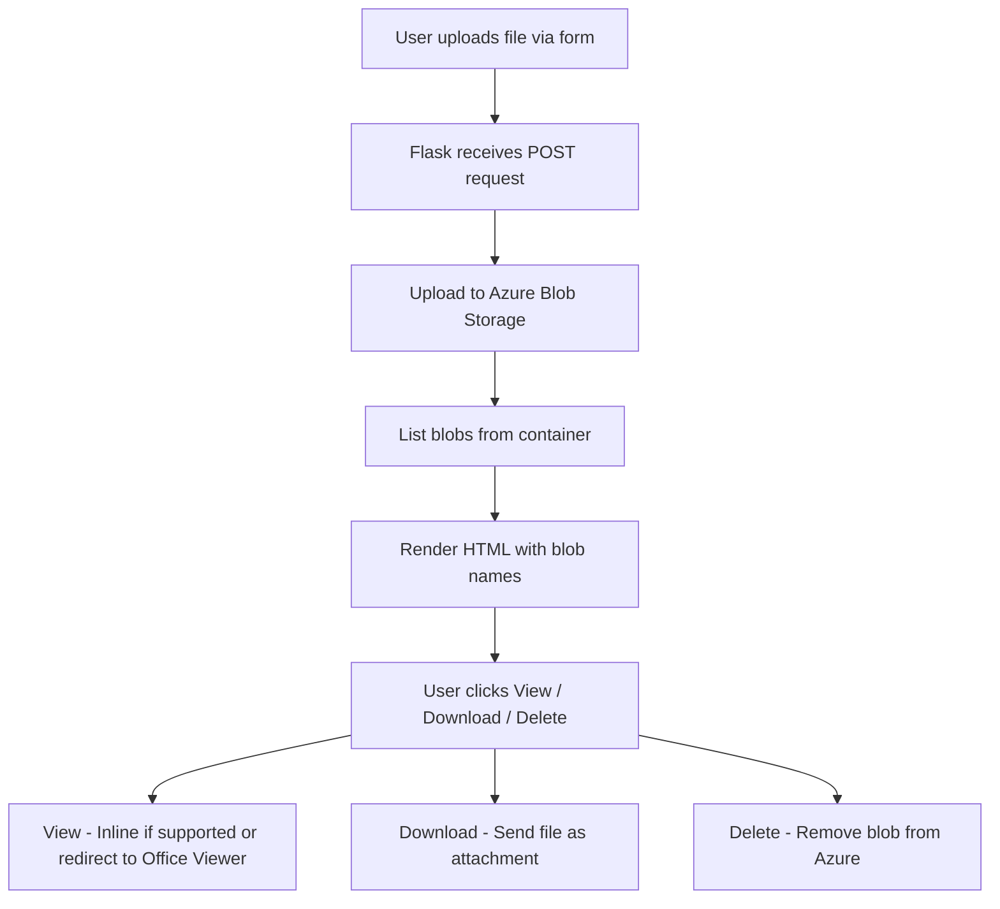

# Azure-media-storage-container

# 📘 Media Storage Web App

A simple browser-based solution to upload, view, download, and delete files from Azure Blob Storage using Flask. Supports secure inline viewing of PDFs, images, text, and DOCX files via Microsoft Office Online.

🎯 Project Goals

Build a minimal web app to demonstrate file management using Azure Blob Storage

Enable secure document viewing without downloading files

Support image and PDF inline rendering in-browser

Provide a portable, cloud-based dev environment using GitHub Codespaces

Lay foundation for future improvements like login, search, and tagging

👥 User Stories

As a user, I want to upload documents through a web form so that I can store them in the cloud.

As a user, I want to see a list of all uploaded files so that I can choose which one to download or delete.

As a user, I want to click 'View' on a supported file type and view it in-browser without downloading.

As a user, I want to view .docx files without installing Word by opening them via Office Online.

As a developer, I want to deploy and test the app on GitHub Codespace without local dependencies.

As a developer, I want secure access to Azure Blob Storage using environment variables.


---

## 📁 Project Structure

| File/Folder            | Description                                      |
| ---------------------- | ------------------------------------------------ |
| `app.py`               | Main Flask application file with route logic     |
| `templates/index.html` | Jinja2 HTML template for upload/view UI          |
| `.env`                 | Secret keys and environment variables            |
| `.venv/`               | Python virtual environment (Codespace-generated) |
| `.devcontainer/`       | GitHub Codespace config (if present)             |

---

## ⚙️ Environment Setup

### 🔐 .env File

```
AZURE_STORAGE_CONNECTION_STRING=your_connection_string_here
AZURE_STORAGE_CONTAINER_NAME=your_container_name_here
```

### 📦 Install Dependencies

```bash
pip install flask azure-storage-blob python-dotenv
```

---

## 🚀 Running the App

### Locally or in GitHub Codespace:

```bash
python app.py
```

Visit `http://127.0.0.1:5000` or your Codespace public URL.

---

## 🌐 Flask Routes Summary

| Route                  | Method   | Purpose                                  |
| ---------------------- | -------- | ---------------------------------------- |
| `/`                    | GET/POST | Upload files + display stored blobs      |
| `/download/<filename>` | GET      | Download selected file                   |
| `/view/<filename>`     | GET      | Inline view file or redirect for `.docx` |
| `/delete/<filename>`   | GET      | Delete the file from Azure               |

---

## ☁️ Azure Blob Storage Integration

### Upload File:

```python
blob_client.upload_blob(file, overwrite=True)
```

### Download File:

```python
blob_data = blob_client.download_blob().readall()
```

### Delete File:

```python
blob_client.delete_blob()
```

### View `.docx` Securely:

* Generate short-term SAS URL with `generate_blob_sas()`
* Redirect to:
  `https://view.officeapps.live.com/op/view.aspx?src=<URL_ENCODED_SAS_LINK>`

---

## 🖼️ Jinja2 HTML Template: `index.html`

Lists uploaded files and provides action buttons:

```jinja2

    {{ blob.name }}
    <a href="{{ url_for('view_file', filename=blob.name) }}">View</a>
    <a href="{{ url_for('download_file', filename=blob.name) }}">Download</a>
    <a href="{{ url_for('delete_file', filename=blob.name) }}">Delete</a>

```

---

## 🔄 Workflow Diagram



---

## ✅ Completed Features

* [x] Upload file to Azure
* [x] View file inline (.pdf, .png, .jpg, .txt)
* [x] Securely view `.docx` via Office viewer + SAS
* [x] Download stored files
* [x] Delete stored files
* [x] Hosted on GitHub Codespace

---

## 💡 Ideas for Future Enhancements

* Use Bootstrap for improved UI
* Add file icons + type filter
* Support video/audio previews
* Display file size, date, type
* Add user authentication
* Add metadata search or sorting

---

## 🧾 License

MIT (or specify your preferred license)

---

## 🙋‍♂️ Author

Siddartha Patnaik
